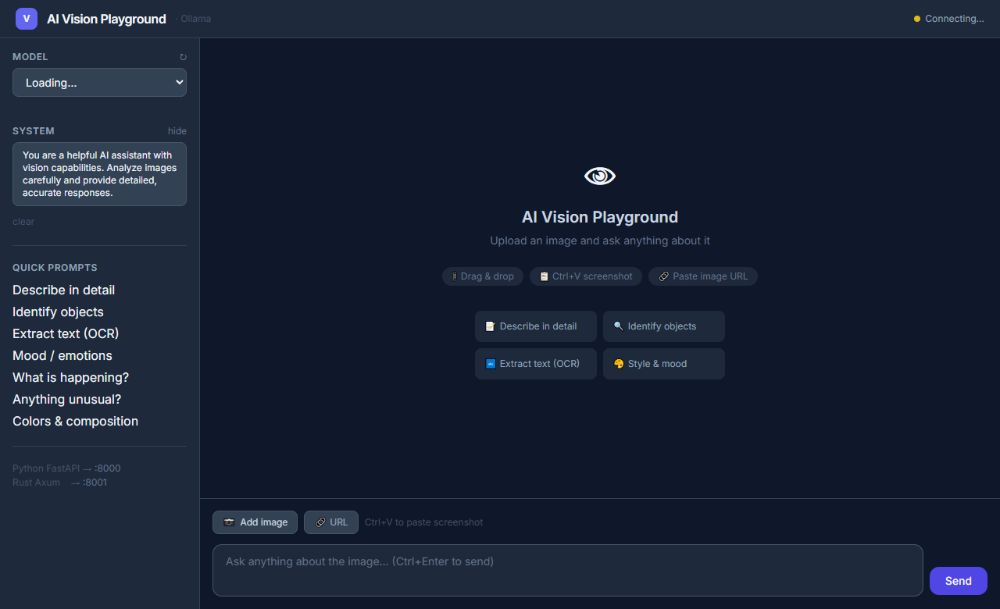

<div align="center">

# 👁 AI Vision Model Playground

**A local, privacy-first web playground for vision-language models — powered by [Ollama](https://ollama.com)**

[](https://python.org)
[](https://rust-lang.org)
[](https://fastapi.tiangolo.com)
[](https://github.com/tokio-rs/axum)
[](https://ollama.com)
[](LICENSE)



*Chat with local vision models — no cloud, no API key, fully offline*

</div>

---

## What is this?

AI Vision Model Playground is a **single-page web app** for interacting with local vision-language models (VLMs) through [Ollama](https://ollama.com). Upload a screenshot, photo, or any image and ask anything — describe it, extract text, identify objects, analyze mood, or run custom prompts — all running **100% locally on your machine**.

It ships with **two interchangeable backends**: Python (FastAPI) and Rust (Axum), both serving the same frontend.

---

## Features

- **Drag & drop** images or click to browse
- **Ctrl+V** — paste screenshots directly from your clipboard
- **Image URL** — load any image by pasting a URL
- **Streaming responses** — tokens appear in real time
- **Conversation history** — full multi-turn chat log per session
- **Stop generation** — abort mid-stream at any time
- **Image zoom** — click any image to expand fullscreen
- **System message editor** — customize model behavior from the UI
- **Quick prompts** — one-click starters (describe, OCR, objects, mood…)
- **Model detection** — vision-capable models are automatically flagged
- **Two backends** — Python FastAPI (`:8000`) or Rust Axum (`:8001`)

---

## Supported Models

| Model | Pull Command | Size | Strength |
|-------|-------------|------|----------|
| **LLaVA 7B** | `ollama pull llava` | 4.7 GB | General vision, widely tested |
| **LLaVA 13B** | `ollama pull llava:13b` | 8.0 GB | Higher accuracy |
| **LLaVA-Phi3** | `ollama pull llava-phi3` | 2.9 GB | Fast, small footprint |
| **Qwen2-VL 7B** | `ollama pull qwen2-vl` | 4.9 GB | Excellent OCR & diagrams |
| **Qwen2.5-VL 7B** | `ollama pull qwen2.5vl` | 5.0 GB | Latest Qwen vision |
| **Gemma 3 4B** | `ollama pull gemma3:4b` | 3.3 GB | Google, fast & capable |
| **Gemma 3 12B** | `ollama pull gemma3:12b` | 8.1 GB | Higher quality |
| **Llama 3.2 Vision** | `ollama pull llama3.2-vision` | 7.9 GB | Meta's vision model |
| **Moondream** | `ollama pull moondream` | 1.7 GB | Tiny, very fast |
| **MiniCPM-V** | `ollama pull minicpm-v` | 5.5 GB | High resolution support |
| **BakLLaVA** | `ollama pull bakllava` | 4.7 GB | Mistral-based vision |

> Any model not in this list will still appear in the dropdown — vision models are auto-detected by name pattern.

---

## Quick Start

### 1 — Install & start Ollama

```bash
# Install from https://ollama.com, then:
ollama serve

# Pull a small vision model to start
ollama pull llava          # 4.7 GB, reliable
ollama pull moondream      # 1.7 GB, fastest
ollama pull gemma3:4b      # 3.3 GB, good quality
```

### 2 — Run the Python backend (FastAPI)

```bash
# Requires Python 3.13
cd python
pip install -r requirements.txt
python server.py
```

Open **http://localhost:8000**

### 3 — Or run the Rust backend (Axum)

```bash
# Requires Rust stable (https://rustup.rs)
cd rust
cargo run --release
```

Open **http://localhost:8001**

---

## How to Use

1. **Select a model** from the sidebar — vision models are marked `✓ Vision capable`
2. **Add an image** — drag & drop, click *Add image*, paste a URL, or press **Ctrl+V** to paste a screenshot
3. **(Optional)** Edit the **System Message** to customize the model's behavior
4. **Type your prompt** or click a quick prompt from the sidebar
5. Press **Send** or **Ctrl+Enter** — the response streams in real time
6. Keep chatting — all turns stay visible in the conversation history
7. Press **Stop** at any time to abort generation

---

## Project Structure

```
.
├── index.html              # Single-page frontend (served by either backend)
├── assets/
│   └── screenshot.png      # UI preview
├── python/
│   ├── server.py           # FastAPI + Ollama proxy
│   └── requirements.txt    # fastapi, uvicorn, httpx, python-multipart
├── rust/
│   ├── src/main.rs         # Axum + Ollama proxy
│   └── Cargo.toml          # axum, reqwest, serde, tokio, tower-http
└── .gitignore
```

---

## API Reference

Both backends expose the same two endpoints:

### `GET /api/models`
Returns all installed Ollama models with a `vision` flag.

```json
{
  "models": [
    { "name": "llava:latest",   "vision": true  },
    { "name": "llama3:latest",  "vision": false }
  ]
}
```

### `POST /api/chat` — `multipart/form-data`

| Field | Type | Required | Description |
|-------|------|----------|-------------|
| `model` | string | ✓ | Ollama model name |
| `prompt` | string | ✓ | User message |
| `system` | string | | System message |
| `image` | file | | Uploaded image |
| `image_url` | string | | Image URL (used if no file) |

**Response:** NDJSON stream — each line is a JSON object:
```json
{"message": {"role": "assistant", "content": "token..."}, "done": false}
{"message": {"role": "assistant", "content": ""}, "done": true, "total_duration": 3210000000, "eval_count": 142}
```

---

## Tech Stack

| Layer | Python Backend | Rust Backend |
|-------|---------------|-------------|
| Web framework | [FastAPI](https://fastapi.tiangolo.com) | [Axum](https://github.com/tokio-rs/axum) |
| Async runtime | asyncio | [Tokio](https://tokio.rs) |
| HTTP client | [httpx](https://www.python-httpx.org) | [reqwest](https://github.com/seanmonstar/reqwest) |
| CORS | FastAPI middleware | [tower-http](https://github.com/tower-rs/tower-http) |
| Streaming | `StreamingResponse` | `Body::from_stream` |
| Frontend | Vanilla JS + [Tailwind CSS](https://tailwindcss.com) | ← same |
| Model runtime | [Ollama](https://ollama.com) | ← same |

---

## Requirements

| Component | Minimum |
|-----------|---------|
| RAM | 8 GB (16 GB recommended for 7B+ models) |
| Disk | 2–10 GB per model |
| GPU | Optional — CPU inference works, GPU is faster |
| OS | Windows, macOS, Linux |
| Python | 3.13+ (Python backend) |
| Rust | stable (Rust backend) |
| Ollama | latest |

---

## License

MIT — free to use, modify, and distribute.

---

<div align="center">

Built with Python 3.13 · FastAPI · Rust · Axum · Ollama · Tailwind CSS

*Run AI vision models locally — no cloud, no subscriptions, no data sent anywhere*

</div>
